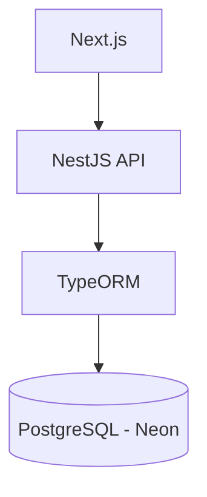

# 🚀 NestJS API


API REST desenvolvida com **NestJS**, seguindo boas práticas de arquitetura,
segurança e organização.

O projeto foi criado para servir como backend de uma aplicação Full Stack
desenvolvida com **Next.js**, oferecendo autenticação, gerenciamento de
usuários, gerenciamento de posts, upload de arquivos e persistência de dados
utilizando **PostgreSQL** e **TypeORM**.

---

## 🔗 Links

- 🌐 **Frontend:** https://nextjs-for-nestjs-xi.vercel.app
- 🚀 **Backend:** https://nestjs-for-nextjs-hfue.onrender.com
- 📂 **Repositório:** https://github.com/Matpires02/nestjs-for-nextjs

---

## 📖 Sobre

Este projeto foi desenvolvido com o objetivo de aprofundar conhecimentos em
desenvolvimento backend utilizando **NestJS**, abordando conceitos como:

- Arquitetura modular
- APIs REST
- Autenticação JWT
- Persistência de dados
- Segurança
- Deploy em produção

---

## ✨ Funcionalidades

- 🔐 Autenticação utilizando JWT
- 👤 Cadastro e gerenciamento de usuários
- 📝 CRUD de posts
- 📤 Upload de arquivos
- 🛡️ Rotas protegidas com Guards
- ✅ Validação automática de requisições
- ⚠️ Tratamento global de exceções
- 🚦 Rate Limiting
- 🔒 Criptografia de senhas com bcrypt
- 🌐 Configuração segura de CORS
- 🛡️ Headers HTTP seguros utilizando Helmet

---

## ⭐ Destaques

- Arquitetura modular utilizando NestJS
- API REST
- PostgreSQL + TypeORM
- Autenticação JWT
- Upload de arquivos
- Rate Limiting
- Helmet
- Validation Pipes
- Exception Filters
- Deploy preparado para produção

---

## 🏗️ Arquitetura



---

## 🛠️ Tecnologias

### Backend

- NestJS
- Node.js
- TypeScript
- TypeORM
- PostgreSQL

### Segurança

- JWT
- bcrypt
- Helmet
- ThrottlerModule
- CORS

### Qualidade

- ValidationPipe
- Exception Filters
- Guards

---

## 📂 Estrutura do projeto

```text
src/
├── auth/
│   ├── dto/
│   ├── guards/
│   ├── strategies/
│   └── ...
├── common/
│   ├── filters/
│   ├── hashing/
│   ├── utils/
│   └── ...
├── post/
├── upload/
├── user/
├── app.module.ts
└── main.ts
```

---

## ⚙️ Variáveis de ambiente

Crie um arquivo `.env` baseado no arquivo:

```text
.env.example
```

### Variáveis

| Variável         | Descrição                                                   |
| ---------------- | ----------------------------------------------------------- |
| `DATABASE_URL`   | URL de conexão com o PostgreSQL                             |
| `JWT_SECRET`     | Chave utilizada para geração dos tokens JWT                 |
| `PORT`           | Porta da aplicação                                          |
| `DB_SYNCHRONIZE` | Sincronização automática do banco (somente desenvolvimento) |
| `CORS_WHITELIST` | Lista de domínios permitidos                                |

---

## ▶️ Instalação

Instale as dependências:

```bash
npm install
```

Configure o arquivo `.env`.

Execute a aplicação:

```bash
npm run start:dev
```

A API ficará disponível em:

```text
http://localhost:3000
```

---

## 🚀 Deploy

A aplicação foi preparada para execução em produção utilizando:

| Serviço        | Plataforma        |
| -------------- | ----------------- |
| Frontend       | Vercel            |
| Backend        | Render            |
| Banco de dados | Neon (PostgreSQL) |

---

## 🔐 Segurança

O projeto implementa diversas práticas para aumentar a segurança da aplicação:

- Autenticação baseada em JWT
- Hash de senhas utilizando bcrypt
- Rate Limiting para proteção contra abuso
- Helmet para configuração de headers HTTP
- Guards para controle de acesso
- ValidationPipe para validação automática
- Exception Filters para padronização das respostas de erro

---

## 🗄️ Banco de dados

A persistência dos dados é realizada utilizando **TypeORM** com **PostgreSQL**.

Principais recursos utilizados:

- Entidades
- Repositórios
- Migrations
- Configuração via variáveis de ambiente

---

## 📚 Documentação das rotas

As requisições da API estão disponíveis em:

```text
rest-client/request.http
```

Compatível com:

- VS Code REST Client
- JetBrains HTTP Client

### Exemplo

```http
### Login

POST http://localhost:3000/auth/login
Content-Type: application/json

{
  "email": "user@email.com",
  "password": "password"
}
```

---

## 🧪 Testes

Executar os testes:

```bash
npm run test
```

Cobertura:

```bash
npm run test:cov
```

---

## 📦 Scripts

| Script               | Descrição                          |
| -------------------- | ---------------------------------- |
| `npm run start`      | Executa a aplicação                |
| `npm run start:dev`  | Executa em modo de desenvolvimento |
| `npm run build`      | Gera o build da aplicação          |
| `npm run start:prod` | Executa a versão compilada         |
| `npm run test`       | Executa os testes                  |
| `npm run test:cov`   | Gera o relatório de cobertura      |

---

## 🚧 Roadmap

- [x] Autenticação JWT
- [x] CRUD de usuários
- [x] CRUD de posts
- [x] Upload de arquivos
- [x] PostgreSQL
- [x] Deploy
- [ ] Documentação com Swagger
- [ ] Refresh Token
- [ ] Testes End-to-End
- [ ] Docker
- [ ] GitHub Actions (CI/CD)

---

## 📌 Boas práticas adotadas

- Arquitetura modular
- Separação de responsabilidades
- Configuração por variáveis de ambiente
- Tratamento centralizado de exceções
- Validação automática de dados
- Rotas protegidas por Guards
- Criptografia de senhas
- Utilização de JWT para autenticação
- Código organizado e escalável

---

## 🤝 Contribuição

Contribuições são bem-vindas.

Caso encontre algum problema ou tenha sugestões de melhoria, fique à vontade
para abrir uma **Issue** ou enviar um **Pull Request**.

---

## 📄 Licença

Este projeto foi desenvolvido para fins de estudo e demonstração de
conhecimentos em desenvolvimento backend utilizando NestJS.

---

## 👨‍💻 Autor

Desenvolvido por **Matheus Pires**.

Este projeto foi criado para consolidar conhecimentos em:

- Arquitetura de APIs REST
- NestJS
- TypeORM
- PostgreSQL
- Segurança de aplicações
- Deploy em produção

⭐ Caso este projeto tenha sido útil para você, considere deixar uma estrela no
repositório.
